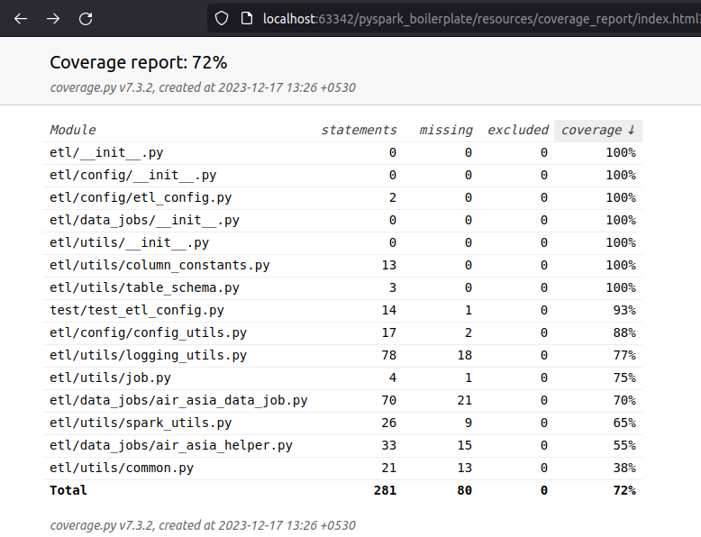
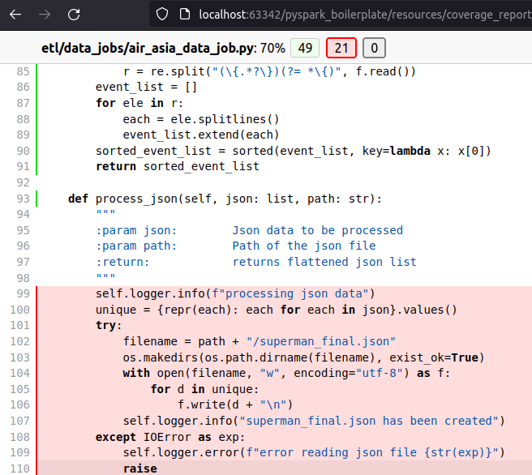

# Pyspark Boilerplate


## Preface: 
This is a sample pyspark project designed to work as a boilerplate application. This application is written by following 
object oriented programming and various Design Principles like Abstract Base Class (ABC), Factory Design, Singleton Design Patterns etc. 

The goal behind developing this project is to provide a real exposure to Pyspark and python coding as a production 
environment. And make this boilerplate as production ready as possible using my limited knowledge and experience.

In terms of coverage of spark topics, the goal is to cover all of the High level spark features mentioned here
 - Spark SQL
 - Spark Streaming
 - MLlib
 - GraphX


[TOC: Table of Contents]() 

### Setup: Manually running it locally
In order to use this boilerplate follow the instructions mentioned below: 

1. Set up the `PYTHONPATH`
    ```commandline
    rootfolder="$(pwd)"
    export PYTHONPATH=$PYTHONPATH:$rootfolder
    ```

2. Run this app from command line: Currently there are total 3 pipelines as part of this project.
In order to test the pipeline you can run any or all three jobs locally by running below command. 
All three pipelines should run successfully

    ```commandline
   python3 etl/etl_job.py --job-name air_asia_data_job
   python3 etl/etl_job.py --job-name happiness_index_job
   python3 etl/etl_job.py --job-name bmi_data_job
    ```
   or use the spark-submit command as below
   ```commandline
   spark-submit etl/etl_job.py --job-name air_asia_data_job
   spark-submit etl/etl_job.py --job-name bmi_data_job
   spark-submit etl/etl_job.py --job-name happiness_index_job
   ```

### Using Makefile
Alternative to above steps, you can directly use makefile to perform above actions in a single command. 
```commandline
make run-code
```
The above make command runs spark-submit command so the console log will contain spark logs as well.


# Packaging and distribution
```commandline
make package
```

```
spark-submit --py-files target/spark_etl-0.0.1.zip etl/etl_job.py --job-name air_asia_data_job
```

# Unit Test:
```commandline
python -m coverage run -m unittest discover -s test -p "test*.py" 
    && python -m coverage report 
    && python -m coverage html -d resources/coverage_report

```
Code Coverage Stats:



Code Coverage Display:




# Versioning 
The version of this app is controlled by VERSION file in root directory and invoke based tasks.py
Everytime there is a new release it will call the inc_patch, inc_major, inc_minor functions based 
on the version policy. 
This part is still in development and will be functional soon. 


# --------------------------------------------------------------------
```	
spark-submit \
	--jars jars/any-jar_0.1-0.1.1.jar \
	--py-files datajob.zip \
	src/app/app.py \
	--job-name air_asia_data_job
```


While running spark-submit in spark jupyter docker container. I was getting error:
Jupyter command `file/path` not found
Below stackoverflow article answers this problem. That has to do with  PYSPARK_DRIVER_PYTHON=jupyter
Which should be set to PYSPARK_DRIVER_PYTHON=python. 

export PYSPARK_DRIVER_PYTHON=python
rootfolder="$(pwd)"
export PYTHONPATH=$PYTHONPATH:$rootfolder/spark_etl/etl
export PYTHONPATH=$PYTHONPATH:spark_etl-0.0.1.zip/

Running in docker container: 
rootfolder="$(pwd)"
export PYTHONPATH=$PYTHONPATH:$rootfolder/spark_etl
export PYSPARK_DRIVER_PYTHON=$PYSPARK_DRIVER_PYTHON:/usr/local/bin/python3
export PYSPARK_PYTHON=/usr/local/bin/python3
spark-submit spark_etl/etl/etl_job.py --job-name air_asia_data_job
