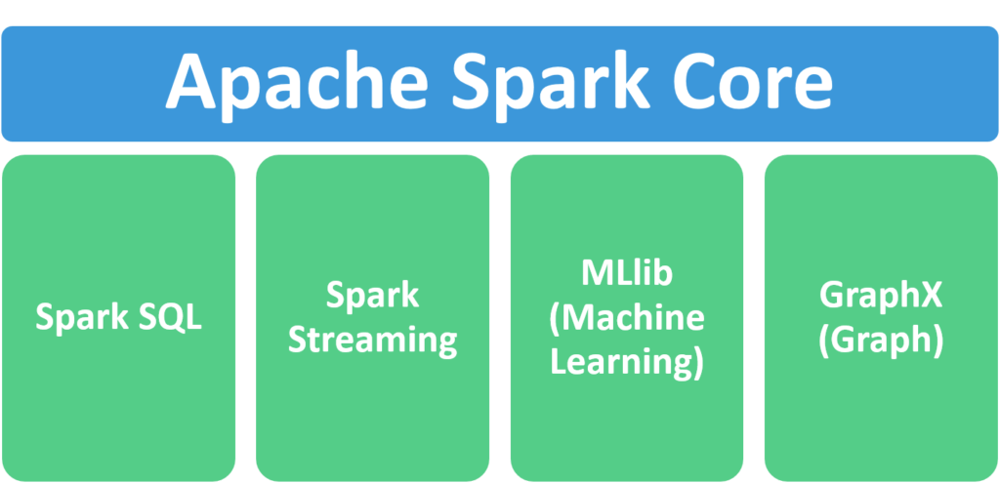

# Pyspark Boilerplate


## Preface: 
This is a sample pyspark project designed to work as a boilerplate application. This application is written by following 
object oriented programming and various Design Principles like Abstract Base Class (ABC), Factory Design, Singleton Design Patterns etc. 

The goal behind developing this project is to provide a real exposure to Pyspark and python coding as a production 
environment. And make this boilerplate as production ready as possible using my limited knowledge and experience.

In terms of coverage of spark topics, the goal is to cover all of the High level spark features mentioned here
 - Spark SQL
 - Spark Streaming
 - MLlib
 - GraphX



[TOC]

### Setup: Manually running it locally
In order to use this boilerplate follow the instructions mentioned below: 

1. Set up the `PYTHONPATH`
    ```commandline
    rootfolder="$(pwd)"
    export PYTHONPATH=$PYTHONPATH:$rootfolder
    ```

2. Run this app from command line: Currently there are total 3 pipelines as part of this project.
In order to test the pipeline you can run any or all three jobs locally by running below command. 
All three pipelines should run successfully

    ```commandline
   python3 etl/etl_job.py --job_name air_asia_data_job
   python3 src/app/app.py --job-name happiness_index_job
   python3 src/app/app.py --job-name bmi_data_job
    ```
   or use the spark-submit command as below
   ```commandline
   spark-submit etl/etl_job.py --job-name air_asia_data_job
   ```

### Using Makefile
Alternative to above steps, you can directly use makefile to perform above actions in a single command. 
```commandline
make run-code
```
The above make command runs spark-submit command so the console log will contain spark logs as well.


# Packaging and distribution


In order to avoid relative path issue, I have tried `package resources api` from setuptools. 
later on this was changed with a python file in root directory named `project_root_dir.py`
The goal is to switch back to package resources api after the project is stable.


```	
spark-submit \
	--jars jars/any-jar_0.1-0.1.1.jar \
	--py-files datajob.zip \
	src/app/app.py \
	--job-name air_asia_data_job
```

While running spark-submit in spark jupyter docker container. I was getting error:
Jupyter command `file/path` not found
Below stackoverflow article answers this problem. That has to do with  PYSPARK_DRIVER_PYTHON=jupyter
Which should be set to PYSPARK_DRIVER_PYTHON=python. 

export PYSPARK_DRIVER_PYTHON=python
export PYTHONPATH=PYTHONPATH:spark_etl/


https://stackoverflow.com/questions/67267683/do-we-need-if-name-main-unittest-main-in-every-unit-tests-file


https://github.com/orgs/community/discussions/25389


What is decorator design pattern? Provide at least one example of Decorator Design Pattern in this code?


## pytest -vvv -rf -q --cov --cov-report term $(PY_MODULES) $(PYTESTFLAGS)
The pytest command runs the pytest testing framework on the specified modules.
The -vvv flag sets the verbosity level to "very very verbose", which means that pytest will print a lot of information about each test.
The -rf flag shows "only failed tests and any important information", suppressing the output for passing tests.
The -q flag suppresses extra information when running tests.
The --cov flag enables code coverage measurement with pytest-cov.
The --cov-report term flag specifies that coverage statistics should be printed to the terminal in a simple format.
The $(PY_MODULES) variable should contain a space-separated list of Python module file paths to be tested by pytest.
The $(PYTESTFLAGS) variable can contain additional command-line flags and options to be passed to pytest.

So when you run make test-unit, it will execute the pytest command with the specified options, running the unit tests and measuring code coverage for the specified modules.

https://stackoverflow.com/questions/25436312/gitignore-not-working

https://stackoverflow.com/questions/38776517/how-to-discard-local-changes-and-pull-latest-from-github-repository


Using function as a decorator:
Using @property decorator
Implement @abstractmethod
implement @staticmethod

Implement ABC
Use @dataclass(frozen = true)


